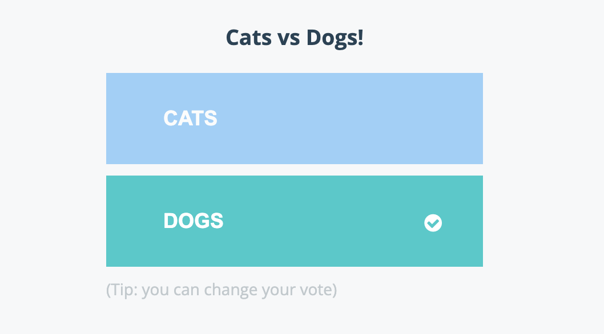

# Ejercicios Dia 01.

En este dia, tenemos los siguientes ejercicios:

- [Ejercicios Dia 01.](#ejercicios-dia-01)
  - [1-python-app](#1-python-app)
  - [2-wordpress](#2-wordpress)
  - [3-voting-app](#3-voting-app)
  - [4-reto-del-dia](#4-reto-del-dia)

## 1-python-app

Aquí tenemos una aplicación de Python (`app.py`), la cual muestra un hola mundo.

Vamos a buildearla:

Estando dentro de la carpeta, hacemos un:

`docker build -t 1-python-app .`

Luego listamos la imagen:

`docker image ls`

Y debemos verla.

Luego la corremos como un container normal:

`docker run 1-python-app`

Y veremos el:

`Hola mundo!`


## 2-wordpress

Aqui tenemos un fichero docker compose, con 2 containers corriendo (db mysql + wordpress), publicando el puerto `8080` y usando unas variables de entorno.

Este ejercicio es más diseñado para probar como exponer una app localmente y acceder a la misma usando docker-compose.

Nos ubicamos en la carpeta de `2-wordpress`, y luego:

`docker-compose up -d`

Luego vamos al navegador y abrimos:

[localhost](http://localhost:8080/)

Viste lo fácil que es usar docker? Ya no necesitas hacer mil pasos para tener un wordpress funcionando en linux.

## 3-voting-app

Aqui tenemos una app multicapa de pruebas, ya mas avanzada.

Ingresa a esta carpeta, y luego ejecuta:

`docker-compose up -d`

Ahora abre tu navegador en http://localhost:4000/

Y elige un voto



Y revisa abajo el container ID que aparce:


Cuentame, ese ID es el mismo que el ID del contenedor llamado: `3-voting-app-result-1` ?

En caso que no, a cuál ID se parece?

Solo por curiosidad, puedes entrar a revisar tu voto en: http://localhost:4001/


## 4-reto-del-dia

Qué debes hacer, para poder consultar la API de kubernetes asi:

`curl http://localhost:8080/api/`

Y para que te salga esto:

```
{
  "kind": "APIVersions",
  "versions": [
    "v1"
  ],
  "serverAddressByClientCIDRs": [
    {
      "clientCIDR": "0.0.0.0/0",
      "serverAddress": "TU IP:8443"
    }
  ]
}
```

**Tip:** Revisa esta documentación:
https://kubernetes.io/docs/tasks/administer-cluster/access-cluster-api/
