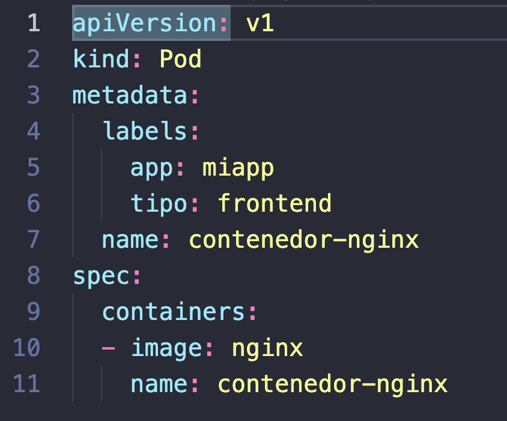
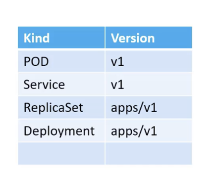

# Ejercicios Dia 02.

En este dia, tenemos los siguientes ejercicios:

- [Ejercicios Dia 02.](#ejercicios-dia-02)
  - [1-definicion-de-pod](#1-definicion-de-pod)
  - [2-desplegando-wordpress](#2-desplegando-wordpress)

## 1-definicion-de-pod

En este ejercicio vamos a ver como es la estructura básica de un pod en kubernetes.

**Tip:** Se generó con el comando:

 `kubectl run contenedor-nginx --image nginx --labels=app=miapp,tipo=frontend --dry-run=client -o yaml > 1-definicion-de-pod.yaml`

Y luego vamos a aplicar dicho pod:

`kubectl apply -f 1-definicion-de-pod.yaml`

Recordando que cada tipo de recurso en kubernetes va enlazado con la versión del api que usa:

## 2-desplegando-wordpress

En este ejercicio, vas a desplegar un wordpress con todos los detalles posibles (PV, PVC, Deployment, servicios).

**Tip:** 

- Revisa el estado de los contenedores, y también sus logs, nunca esta de mal empezar por allí.

Comandos a utilizar:

`kubectl apply -f archivo1,archivo2,archivo3`

`kubectl delete -f archivo1,archivo2,archivo3`

`kubectl get all -n NAMESPACE`

`kubectl logs NombrePod`

`kubectl describe pod NombrePod`

`kubectl get events`

kubectl delete -k ./`
