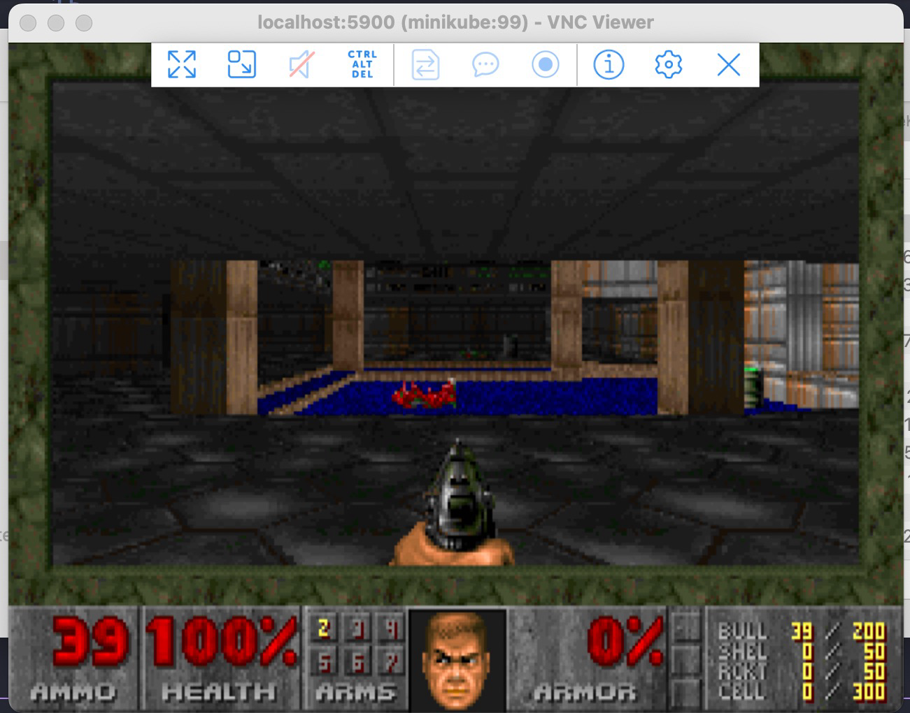

# Ejercicios Dia 03.

En este dia, tenemos los siguientes ejercicios:

- [Ejercicios Dia 03.](#ejercicios-dia-03)
  - [1-kubedoom](#1-kubedoom)
  - [2-replicasets](#2-replicasets)
  - [3-deployments](#3-deployments)
  - [4-arreglame](#4-arreglame)
  - [5-desplegando-apache](#5-desplegando-apache)
  - [6-daemonset](#6-daemonset)
  - [7-nodeport](#7-nodeport)
  - [8-cluster-ip](#8-cluster-ip)

## 1-kubedoom

Vamos a ver el concepto de replicas, y que mejor manera que recordar un juego clásico DOOM.

Para correrlo vamos a usar kustomization asi:

`k apply -k ./*`

Luego de esto, se debe crear un namespace llamado **kubedoom**.

Debo instalar vnc viewer para acceder al juego:

https://www.realvnc.com/en/connect/download/viewer/

Luego hago un port-forward para poder conectar al puerto del juego remotamente:

`kubectl port-forward pod/kubedoom-mi-pod -n kubedoom 5900:5900`

Abres el vncviwer, te conectas a **localhost:5901**, con la clave: **idbehold**

Y ya esta.

El truco es oprimir:
- idspispopd -> Para atravesar paredes.
- idkfa + 5 -> Para tener un arma grande.
- Con las teclas de mueves y disparas con la tecla **control**.

## 2-replicasets

Usando kustomization, aplica los manifiestos dentro de esta carpeta (App de registro de visitantes en redis), y luego usando el comando de `kubectl port-forward` mapea el puerto `8080` de tu ordenador con el `80` de la app, abre la url **localhost:8080** y confirma si los 3 pods estan funcionando.

Ahora, cambia de 3 replicas, a 5 replicas, y revisa que si se hayan creado los pods.

## 3-deployments

Esta vez, vamos a usar deployments.

Para esto, vamos a aplicar el manifiesto de esta carpeta.

Luego vamos a actualizar la imagen de nginx:1.9.1 a nginx:1.7.9

`kubectl --record deployment.apps/nginx-deployment set image deployment.v1.apps/nginx-deployment nginx=nginx:1.9.1`

Importante aqui resaltar que usamos la opción `--record`, para dejar un histórico del cambio.

No es la única manera, también podriamos editar el deployment directamente, aunque no se recomienda.

Ahora vamos a ver el estado del deployment:

`kubectl rollout status deployment nginx-deployment`

Y vamos a provocar un caos:

`kubectl set image deployment nginx-deployment nginx=nginx:1.9099 --record=true`

Como podemos hacer un rollback de cambios a la versión que antes funcionaba?

**Truco:** La respuesta puede estar aquí https://kubernetes.io/es/docs/concepts/workloads/controllers/deployment/

## 4-arreglame

En este ejercicio hay algo mal con el deployment, revisa que es, arreglalo y despliegalo.

## 5-desplegando-apache

Crea un archivo de despliegue y debe tener:
**Nombre:** httpd-frontend
**Replicas:** 3
**Imagen:** httpd:2.4-alpine
Y todo debe correr en el namespace **ejercicio5**

**Importante**, luego de hacer el ejercicio, y comprobar que funcione, elimina todos los recursos y el namespace

**Puntos Extra**: Si usas `kustomization` para hacer el ejercicio.

## 6-daemonset

Para este ejercicio, vamos a ver como seria un archivo de daemonset, usando fluentd.

## 7-nodeport

Ejercicio para ver un servicio tipo NodePort

## 8-cluster-ip

Ejercicio para ver un servicio tipo ClusterIP
