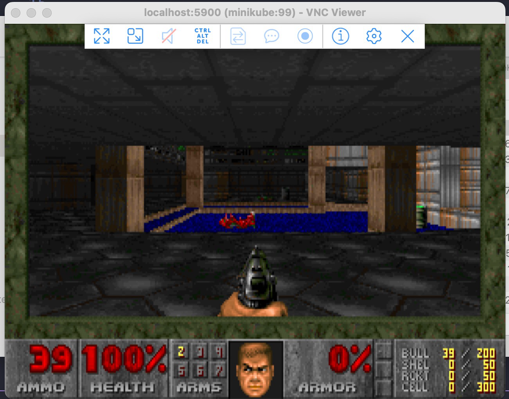

# Ejercicios Dia 03.

En este dia, tenemos los siguientes ejercicios:

- [Ejercicios Dia 03.](#ejercicios-dia-03)
  - [1-kubedoom](#1-kubedoom)
  - [2-replicasets](#2-replicasets)
  - [3-deployments](#3-deployments)
  - [4-arreglame](#4-arreglame)
  - [5-desplegando-apache](#5-desplegando-apache)
  - [6-daemonset](#6-daemonset)
  - [7-nodeport](#7-nodeport)
  - [8-cluster-ip](#8-cluster-ip)
  - [9-metallb](#9-metallb)
  - [10-ingress](#10-ingress)

## 1-kubedoom

Vamos a ver el concepto de replicas, y que mejor manera que recordar un juego clásico DOOM.

Para correrlo vamos a usar kustomization asi:

`k apply -k ./*`

Luego de esto, se debe crear un namespace llamado **kubedoom**.

Debo instalar vnc viewer para acceder al juego:

https://www.realvnc.com/en/connect/download/viewer/

Luego hago un port-forward para poder conectar al puerto del juego remotamente:

`kubectl port-forward pod/kubedoom-mi-pod -n kubedoom 5900:5900`

Abres el vncviwer, te conectas a **localhost:5901**, con la clave: **idbehold**

Y ya esta.



El truco es oprimir:
- idspispopd -> Para atravesar paredes.
- idkfa + 5 -> Para tener un arma grande.
- Con las teclas de mueves y disparas con la tecla **control**.

## 2-replicasets

Usando kustomization, aplica los manifiestos dentro de esta carpeta (App de registro de visitantes en redis), y luego usando el comando de `kubectl port-forward` mapea el puerto `8080` de tu ordenador con el `80` de la app, abre la url **localhost:8080** y confirma si los 3 pods estan funcionando.

Ahora, cambia de 3 replicas, a 5 replicas, y revisa que si se hayan creado los pods.

## 3-deployments

Esta vez, vamos a usar deployments.

Para esto, vamos a aplicar el manifiesto de esta carpeta.

Luego vamos a actualizar la imagen de nginx:1.9.1 a nginx:1.7.9

`kubectl --record deployment.apps/nginx-deployment set image deployment.v1.apps/nginx-deployment nginx=nginx:1.9.1`

Importante aqui resaltar que usamos la opción `--record`, para dejar un histórico del cambio.

No es la única manera, también podriamos editar el deployment directamente, aunque no se recomienda.

Ahora vamos a ver el estado del deployment:

`kubectl rollout status deployment nginx-deployment`

Y vamos a provocar un caos:

`kubectl set image deployment nginx-deployment nginx=nginx:1.9099 --record=true`

Como podemos hacer un rollback de cambios a la versión que antes funcionaba?

**Truco:** La respuesta puede estar aquí https://kubernetes.io/es/docs/concepts/workloads/controllers/deployment/

## 4-arreglame

En este ejercicio hay algo mal con el deployment, revisa que es, arreglalo y despliegalo.

## 5-desplegando-apache

Crea un archivo de despliegue y debe tener:
**Nombre:** httpd-frontend
**Replicas:** 3
**Imagen:** httpd:2.4-alpine
Y todo debe correr en el namespace **ejercicio5**

**Importante**, luego de hacer el ejercicio, y comprobar que funcione, elimina todos los recursos y el namespace

**Puntos Extra**: Si usas `kustomization` para hacer el ejercicio.

## 6-daemonset

Este ejercicio demuestra el uso de DaemonSets en Kubernetes, utilizando Fluentd como ejemplo práctico. Un DaemonSet garantiza que todos los nodos (o algunos, según la configuración) ejecuten una copia del pod.

El ejemplo de Fluentd incluye:
- Un DaemonSet que despliega Fluentd como recolector de logs
- Configuración de tolerations para ejecutar en nodos master
- Montaje de volúmenes para acceder a los logs del sistema
- Labels y selectors apropiados para la identificación del servicio

Para implementar:
```bash
kubectl apply -f fluentd-daemonset.yaml
```

Verifica el despliegue:
```bash
kubectl get daemonset
kubectl get pods -o wide  # Observa cómo hay un pod en cada nodo
```

## 7-nodeport

Este ejercicio muestra cómo exponer una aplicación fuera del cluster usando un servicio tipo NodePort. 

El ejemplo incluye:
- Un Deployment que ejecuta una aplicación web simple
- Un Service de tipo NodePort que expone la aplicación en un puerto alto (30000-32767) en todos los nodos del cluster

Para implementar:
```bash
kubectl apply -f nodeport.yaml
```

Accede a la aplicación:
- A través de cualquier IP de nodo del cluster: `http://<NODE-IP>:<NODE-PORT>`
- El puerto NodePort se asigna automáticamente o se puede especificar en el rango 30000-32767

Verifica el servicio:
```bash
kubectl get svc
kubectl describe svc myapp-service
```

## 8-cluster-ip

Este ejercicio demuestra el uso del tipo de servicio más básico en Kubernetes: ClusterIP. Este tipo de servicio expone la aplicación en una IP interna del cluster.

El ejemplo incluye:
- Un Deployment con múltiples réplicas de una aplicación
- Un Service tipo ClusterIP que proporciona una IP estable y un nombre DNS para acceder a los pods

Para implementar:
```bash
kubectl apply -f cluster-ip.yaml
```

Características principales:
- IP virtual estable dentro del cluster
- Balanceo de carga entre los pods del servicio
- Accesible solo desde dentro del cluster
- Ideal para comunicación entre microservicios

Verifica el servicio:
```bash
kubectl get svc
kubectl describe svc myapp-internal
# Para probar desde dentro del cluster:
kubectl run test-pod --rm -it --image=busybox -- wget -qO- http://myapp-internal
```

## 9-metallb

En este ejercicio vamos a configurar MetalLB, un balanceador de carga para entornos Kubernetes que no están en la nube.

Para implementar MetalLB:

1. Instalar los componentes de MetalLB:
```bash
kubectl apply -f https://raw.githubusercontent.com/metallb/metallb/v0.13.7/config/manifests/metallb-native.yaml

2. Configurar el pool de IPs que MetalLB utilizará:
```bash
kubectl apply -f metallb-config.yaml
```

3. Verificar la instalación:
```bash
kubectl get pods -n metallb-system
```

MetalLB asignará IPs del rango configurado a los servicios de tipo LoadBalancer, permitiéndonos tener balanceo de carga en clusters locales.

## 10-ingress

Este ejercicio demuestra cómo configurar un Ingress básico en Kubernetes para exponer servicios HTTP. El Ingress actúa como un "enrutador de tráfico" a nivel de aplicación.

Para implementar el ejemplo:

1. Asegurarse de tener un Ingress Controller instalado (nginx-ingress)

2. Aplicar la configuración del ejemplo:
```bash
kubectl apply -f ingress.yaml
```

3. Verificar la creación del Ingress:
```bash
kubectl get ingress
```

El ejemplo incluye:
- Un Deployment con un servidor echo
- Un Service que expone el Deployment
- Un Ingress que enruta el tráfico basado en el hostname (echo.example.com)

Para probar localmente, agregar una entrada en `/etc/hosts` apuntando al IP del Ingress Controller.

Más detalles sobre la configuración y pruebas en el README.md del ejercicio.

